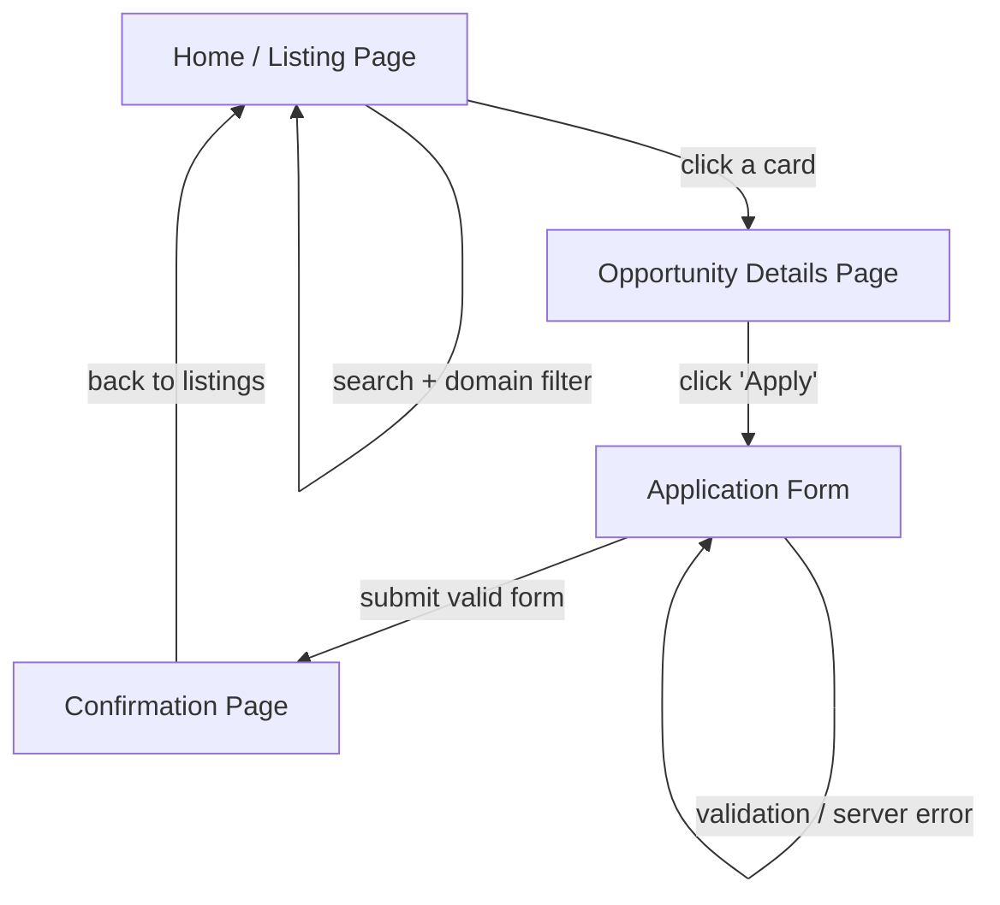
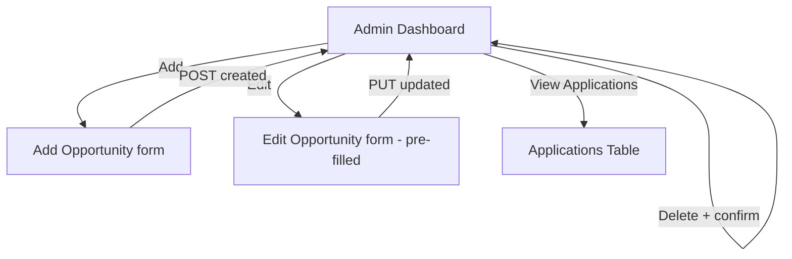

# Application Flow

> The user and admin journeys. If you can narrate these out loud without hesitation,
> Phase 0 is done.

## User journey



In words:
1. User lands on the **listing page** and sees opportunity cards.
2. They optionally **search** (keyword) and **filter by domain** — the list updates.
3. They **click a card** to open the **details page**.
4. They click **Apply**, fill the **form**, and submit.
5. On success they see a **confirmation page**; on error the form keeps their data and shows a message.

## Admin journey



In words:
1. Admin opens the **dashboard** — a table of all opportunities.
2. **Add** → blank form → POST → new opportunity appears in the table and on the public listing.
3. **Edit** → pre-filled form → PUT → changes persist.
4. **Delete** → confirmation prompt → DELETE → removed everywhere.
5. **View Applications** → table of every submission, each showing which opportunity it was for.

## Data flow (the whole stack, one request)

```
React component (useEffect / onSubmit)
      │  axios call (baseURL from env)
      ▼
Express route  →  controller  →  Mongoose model
      │                              │
      │                              ▼
      │                          MongoDB
      ▼
{ success, data, message }  ──►  back to React  ──►  render
```

## Debugging mindset (when something breaks)
Follow the data in this order:
**Browser Network tab** (what did we send?) → **backend logs** (what did it receive?) → **DB** (what got saved?).
